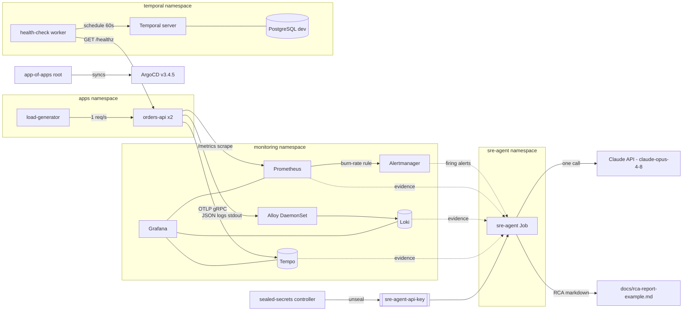

# SRE Platform Assessment

A production-shaped observability platform on **k3d** (k3s-in-Docker), deployed
**entirely via ArgoCD** from this repo. It runs a sample service with full
metrics/traces/logs, an SLO with a multiwindow burn-rate alert, a hand-built
Grafana dashboard, a Temporal health-check workflow, and an **AI SRE agent** that
turns live signals into a root-cause analysis.

Everything after the one-shot bootstrap is GitOps: the app-of-apps root
(`bootstrap/root-app.yaml`) syncs the children in `argocd/platform/`.

## Architecture



## Quickstart

**Prerequisites:** Docker, `kubectl`, and an Anthropic API key (for the agent).
`k3d` is installed by the bootstrap script if missing; ArgoCD renders the Helm
charts server-side, so you don't need `helm` locally.

```bash
# 1. Bring up k3d + ArgoCD + the app-of-apps (everything else syncs from git)
bash bootstrap/install.sh

# 2. Build the locally-authored images and import them into k3d
bash scripts/build-images.sh

# 3. Provide the agent's Anthropic key. The committed SealedSecret is encrypted
#    against THIS project's cluster, so on a fresh cluster create your own:
#    (the sre-agent namespace is created by ArgoCD in step 1 — give it a few seconds)
kubectl create secret generic sre-agent-api-key -n sre-agent \
  --from-literal=ANTHROPIC_API_KEY=<your-key>
```

**Time to green:** ~10–15 minutes on a cold 4-vCPU cluster. Image pulls (Temporal,
kube-prometheus-stack) dominate, and **CPU saturation during the initial pulls is
normal** — the single node is briefly maxed while it unpacks images and starts
everything. Sync waves stagger the pulls (LGTM stack first, Temporal last), but it
still churns. Just watch until it settles:
```bash
watch kubectl get pods -A     # wait until nothing is Pending / ContainerCreating / CrashLoopBackOff
```
A few restarts on the Temporal pods during the first minutes (while Postgres comes
up) are expected and self-heal. Likewise, the locally-built workloads
(`orders-api`, `temporal-healthcheck`) may briefly show `ImagePullBackOff` — ArgoCD
(step 1) starts deploying them before `build-images` (step 2) has imported their
images; they recover automatically once the import lands. `build-images.sh`
verifies each import and retries, so a silent k3d import flake self-corrects.

**Verify:**
```bash
kubectl -n argocd get applications           # every app: Synced / Healthy
kubectl get pods -A | grep -vE 'Running|Completed'   # nothing stuck

# Grafana (admin / admin123) — dashboard "orders-api"
kubectl -n monitoring port-forward svc/kube-prometheus-stack-grafana 3000:80
# Temporal Web — the orders-api-healthcheck schedule + workflow runs
kubectl -n temporal port-forward svc/temporal-web 8080:8080
```

**Run the incident demo** (inject latency+errors on both replicas → burn-rate alert
fires → agent runs → RCA written & chaos reset; ~7 min):
```bash
bash scripts/demo-failure.sh
```

## What's inside

| Area | Component |
| --- | --- |
| GitOps | ArgoCD v3.4.5 app-of-apps (`argocd/platform/`) |
| Metrics / alerting | kube-prometheus-stack (Prometheus, Alertmanager, Grafana) |
| Logs | Loki + Grafana Alloy (DaemonSet, `/var/log/pods` → Loki) |
| Traces | Tempo (OTLP gRPC), linked from logs via a `trace_id` derived field |
| Sample service | `orders-api` (FastAPI + OTel), 2 replicas + a load-generator |
| SLO | `PrometheusRule` — availability SLI, 99.5% target, 14.4× multiwindow (5m+1h) burn alert |
| Dashboard | Hand-built `orders-api` dashboard (ConfigMap): RED, error budget, logs+trace links |
| Workflows | Temporal (Helm) on bundled dev PostgreSQL + a scheduled health-check workflow |
| AI SRE agent | Python Job: deterministic collectors → one Claude call → RCA markdown |
| Secrets | Sealed Secrets (agent API key) |

All workloads carry resource requests/limits, probes, `securityContext`
(non-root, read-only rootfs, dropped caps where possible), and NetworkPolicies
(default-deny per namespace + explicit allows).

## AI SRE agent

The differentiator. On a firing incident the agent (`services/sre-agent/`, a
suspended CronJob triggered on demand) runs **deterministic collectors — no LLM in
the collection path**: Alertmanager firing alerts, Prometheus (error rate, latency,
burn rate, restarts), Loki 5xx logs (capped at 200 lines), Tempo slow/errored
traces with a span breakdown, and Kubernetes pod/events via **read-only RBAC**
(`get`/`list` on pods+events only). The evidence bundle is truncated to a token
budget and sent in **one `claude-opus-4-8` call** (adaptive thinking) that returns a
structured RCA: Summary · Timeline · Root Cause (with confidence) · Evidence (citing
specific metrics, log lines, trace IDs) · Blast Radius · Remediation · What it could
not determine.

A **real** report generated during the burn-rate demo is checked in at
[`docs/rca-report-example.md`](docs/rca-report-example.md) — it correctly root-caused
injected errors (honest *Medium* confidence), cited specific trace IDs, and kept the
service incident separate from baseline k3d control-plane noise.

## Design decisions

| Decision | Why |
| --- | --- |
| **k3d** over VM-based k3s | Reviewers need only Docker; reproducible from `bootstrap/`. |
| **ArgoCD v3.4.5**, pinned | Matches the k8s 1.35 `terminatingReplicas` schema. Its CRDs exceed the annotation size limit, so bootstrap installs them with **server-side apply**. |
| **App-of-apps** GitOps | One root Application syncs `argocd/platform/`; nothing is `kubectl apply`-ed except the bootstrap. |
| Plain **Prometheus**, no Mimir/Thanos | Single node. Multi-cluster long-term storage would be Mimir/Thanos in prod. |
| **No OTel Collector** locally | `orders-api` exports OTLP/gRPC straight to Tempo. Prod would run a Collector DaemonSet for batching + tail sampling. |
| **No CPU limits** | CPU requests drive scheduling; a limit only adds throttling/tail latency. Memory *is* limited (OOM is the real failure mode). |
| **Grafana Alloy** for logs, not Promtail | Promtail is EOL; Alloy is Grafana's successor. DaemonSet tails `/var/log/pods` → Loki. |
| Alloy as **root, zero capabilities** | Pod logs are `0640 root:root`, so uid 0 is needed to read them — but via file *ownership*, so all caps are dropped, rootfs + the `/var/log` mount are read-only, and priv-esc is off. Non-root would need `CAP_DAC_READ_SEARCH`, a broader grant. |
| **Temporal on bundled PostgreSQL** (dev) | A single-instance postgres (`emptyDir`) via the Temporal Helm chart — a dev datastore. Prod would use HA Postgres/Aurora + Elasticsearch visibility. |
| Temporal tuned down for local | `numHistoryShards: 4` (prod default is 512) and trimmed requests. 512 shards run 512 shard controllers and saturate a single-node cluster; 4 is ample for a health-check workflow. Prod uses 512+ across dedicated history nodes. |
| **Sealed Secrets** for the agent key | The controller is deployed and the key is sealed (never plaintext in git). A `SealedSecret` is encrypted against one cluster's keypair, so it can't be a portable synced resource — reviewers create the Secret directly (quickstart step 3) or seal their own against their cluster (`docs/examples/sealed-api-key.example.yaml`). |
| Grafana admin password inline | `admin123`, local-only convenience — the one deliberately un-sealed secret. |

## Repo layout
- `bootstrap/` — one-shot k3d + ArgoCD install (the only thing applied outside ArgoCD).
- `argocd/platform/` — app-of-apps children (ArgoCD Applications), sync-wave ordered.
- `manifests/` — raw manifests referenced by those Applications.
- `services/` — application source (`orders-api`, `sre-agent`, `temporal-healthcheck`).
- `scripts/` — image builds + the incident demo.
- `docs/` — build plan and the example RCA.
- `ai-log/` — human-readable transcripts of the AI build sessions.

## Roadmap
- **OTel Collector** (DaemonSet) with tail-based sampling instead of direct OTLP-to-Tempo.
- **Mimir/Thanos** for durable, multi-cluster metric storage.
- **Alertmanager-webhook-triggered agent** — fire the RCA Job automatically on a page, instead of the manual demo trigger.
- **Argo Rollouts** for progressive delivery (canary/blue-green) of `orders-api`.
- **EKS + Karpenter** translation: swap k3d for EKS, local-path for EBS/EFS CSI, and node autoscaling via Karpenter.
